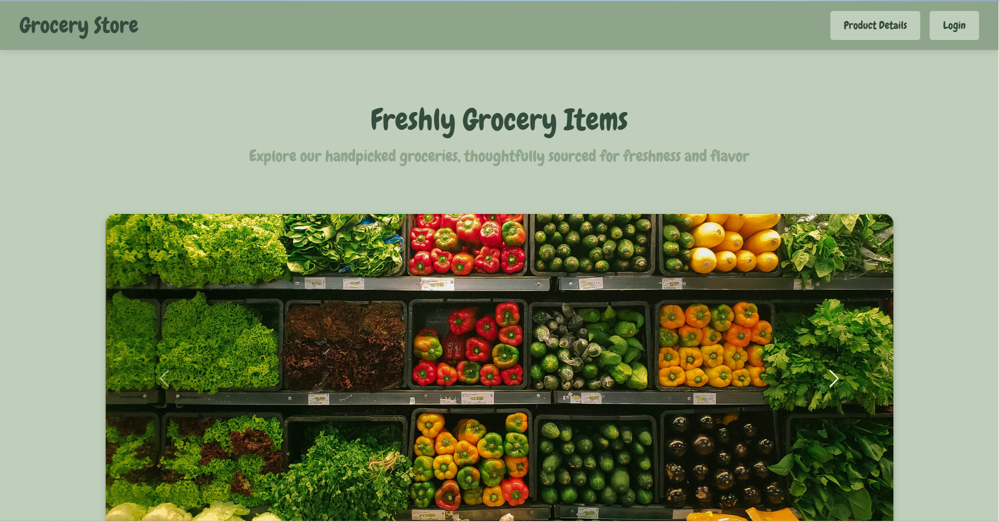

# Online Grocery Store 🥒🍅
A Web app grocery store built using Java (Spring Boot Framework) and Mysql.

## Features
- view grocery items
- view each items detail
- order grocery items
- edit the cart

## Technologies
- Java
- Spring Boot
- tomcat server
- Mysql

## Screenshots

## How to Run the Web App
1. Clone the repository into a folder.
2. Open Spring Tool Suite(STS) IDE.
3. In the STS, click File > import > Existing Maven Project > Browse...
4. Right Click on the project > select Maven > Update Project > ok.
5. Right Click on the project > select Run As > Maven Build.. > in the 'Goals' input, type: "clean install" > Apply > Run.
6. Make sure the tomcat server is running.
7. Make sure Mysql is running.
8. Right Click on the project > select Run As > Run on Server > choose the server > Click Next > Click Finish.
